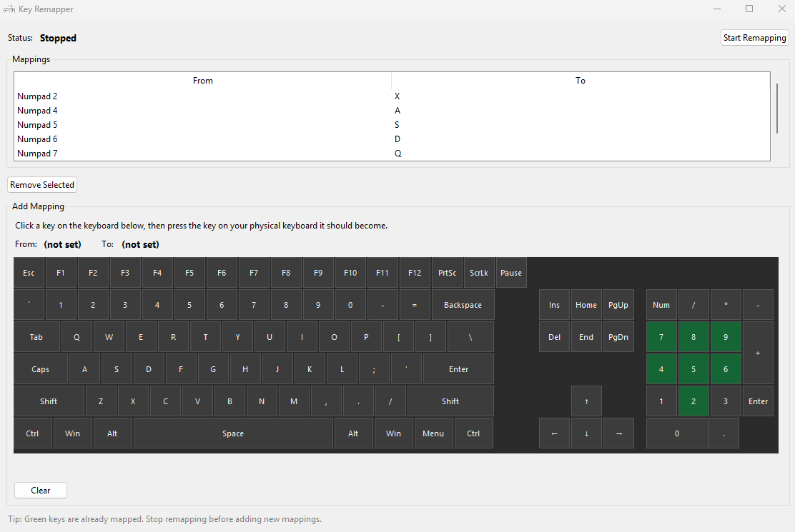

# Key Remapper



A GUI app that remaps any key to any other key. Useful for games with limited rebinding like pc-98 games which typically used numpad for movement.
## Features

- Remap any key to any other key via a simple GUI
- Full-size on-screen keyboard - pick target keys you do not have (numpad, nav cluster, etc.)
- Press a key on your physical keyboard, then click the virtual key it should become
- Start/stop remapping without closing the app
- Mappings saved automatically to `mappings.json`
- Buildable as a standalone `.exe` (no Python install required on the target machine)

## Project files

| File                 | Purpose                              |
|----------------------|--------------------------------------|
| `keyboard.py`        | Main GUI entry point                 |
| `keyboard_layout.py` | Full-size keyboard layout definition |
| `keyboard_widget.py` | Visual clickable keyboard widget     |
| `key_utils.py`       | Key serialization and display names  |
| `remapper_engine.py` | Background keyboard listener         |
| `pyproject.toml`     | Project metadata and dependencies    |
| `uv.lock`            | Locked dependency versions (uv)      |
| `build.bat`          | One-click executable build script    |
| `mappings.json`      | Saved key mappings (created at run)  |
| `assets/`            | App icon (`.ico`) and README image   |

## Setup

This project uses [uv](https://docs.astral.sh/uv/) for dependency management. Install uv if you do not have it yet:

```powershell
powershell -ExecutionPolicy ByPass -c "irm https://astral.sh/uv/install.ps1 | iex"
```

Create the virtual environment and install dependencies:

```powershell
uv sync
```

## Run from source

```powershell
uv run python keyboard.py
```

## Build the executable

Manually (after `uv sync`):
```powershell
uv run pyinstaller keyboard.spec
```

Or without the spec file:
```powershell
uv run pyinstaller --onefile --windowed --name keyboard --icon assets/keyboard_linux_6170.ico --add-data "assets/keyboard_linux_6170.ico;assets" keyboard.py
```

To ship with current mappings:
```powershell
uv run pyinstaller keyboard.spec --add-data "mappings.json;."
```

If on windows:
```powershell
.\build.bat
```

The executable is written to `dist\keyboard.exe`. Place or keep `mappings.json` in the same folder as the exe to persist your bindings.

## Usage

1. Open the app (`uv run python keyboard.py` or `dist\keyboard.exe`).
2. Press a key on your **physical keyboard** (the key you want to remap from).
3. Click the matching key on the **visual keyboard** (what it should become — e.g. numpad keys for pc-98 games).
4. Click **Start Remapping** and leave the app running in the background while you play.

Green keys on the visual keyboard are already used as mapping targets.

To remove a mapping, select it in the list and click **Remove Selected**.

## Notes

- Keep **Num Lock on** when using numpad keys.
- **Stop remapping** before adding new mappings.
- Some games require running the app **as Administrator** for key suppression to work.
- Supports single-key to single-key remapping only (not typing whole strings).

## Credits

Keyboard linux icon by Everaldo on [Icon-Icons.com](https://icon-icons.com/authors/28-everaldo).
